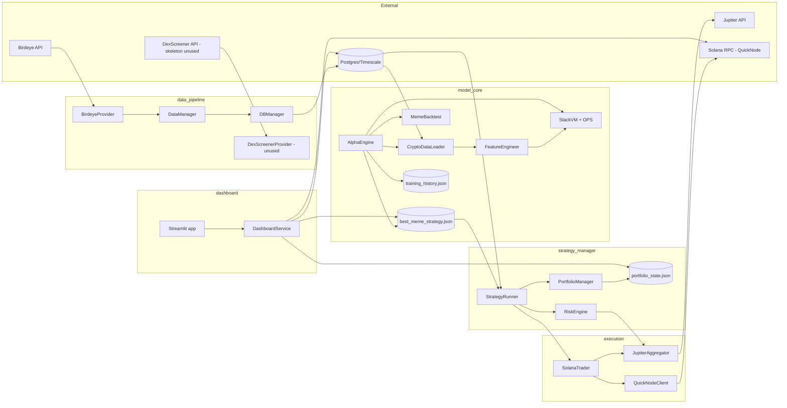
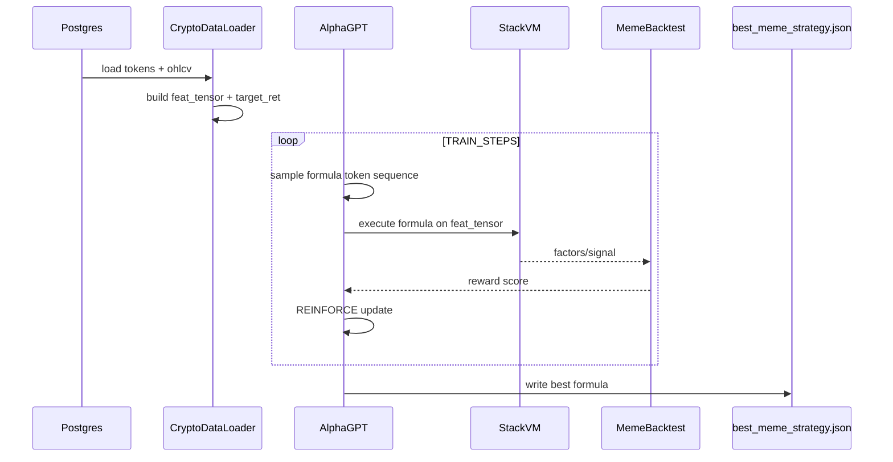

# 介绍

AlphaGPT 是面向 Solana meme 生态的量化交易系统，采用分层流水线：

1. 从外部 API 采集行情与代币数据并写入 Postgres/Timescale。
2. 特征工程 + 公式生成训练（AlphaGPT 模型 + StackVM + 回测）。
	1. AlphaGPT transformer模型 输出逆波兰的算子+特征算术表达式
	2. StackVM根据特征+表达式合成因子
	3. 对因子建立position和turnover矩阵 从而计算回报率和最终得分
	4. 利用得分进行策略梯度loss 反向传播给AlphaGPT
3. 实盘交易循环：推理、风控、交易执行（Jupiter + Solana RPC）。
4. 监控看板：从数据库、状态文件与 RPC 读取数据进行展示。

核心思想：模型不直接预测价格，而是生成公式 token 序列，由 `StackVM` 在特征张量上解释执行，输出信号用于回测与实盘决策。

# 组件架构图



- birdeye.so: SUI和SOL链的热门数据平台 这里能获取defi交易代币和代币的ohlcv
- FDV = 当前代币价格 × 代币最大供应量（Maximum Supply）
- asyncpg： 是一个专为 PostgresQL 数据库设计的高性能、异步 Python 客户端库
- **DEX Screener**：是一个功能强大的**去中心化交易所（DEX）实时数据分析与聚合平台** (备用数据源)
- TimescaleDB： 时序数据库 
- Jupiter 在 **Solana 生态**里通常指 **Jupiter Aggregator**（一个 DEX 聚合器，用来找最优交易路径）。查询 token swap 报价


# 特征工程(算子+因子)

用到的特征如下：
- returns 1m回报率
- returns的 20窗口的波动率
- 交易量相比于20窗口滑动平均的比值
- 收盘价大于60窗口滑动平均表示趋势 (boolean)

数据清洗：
- 正无穷和负无穷都替换为0

```python
    @staticmethod
    def add_basic_factors(df):
        # Log Returns
        df['log_ret'] = np.log(df['close'] / df['close'].shift(1))
        
        # Realized Volatility
        df['volatility'] = df['log_ret'].rolling(window=20).std()
        
        # Volume Shock
        vol_ma = df['volume'].rolling(window=20).mean() + 1e-6
        df['vol_shock'] = df['volume'] / vol_ma
        
        # Price Trend
        ma_long = df['close'].rolling(window=60).mean()
        df['trend'] = np.where(df['close'] > ma_long, 1, -1)
        
        # Robust Normalization
        df = df.replace([np.inf, -np.inf], np.nan).fillna(0)
        
        return df
```

作者的其他补充：
- 主流程因子（FeatureEngineer，6 个）
  - ret：对数收益
  - liq_score：流动性/FDV 健康度
  - pressure：买卖力量不平衡
  - fomo：成交量加速度
  - dev：价格偏离均值
  - log_vol：对数成交量
- 扩展因子（AdvancedFactorEngineer，12 个）
  - ret：对数收益
  - liq_score：流动性/FDV 健康度
  - pressure：买卖力量不平衡
  - fomo：成交量加速度
  - dev：价格偏离均值
  - log_vol：对数成交量
  - vol_cluster：波动率聚集
  - momentum_rev：动量反转
  - rel_strength：相对强弱（RSI 类）
  - hl_range：高低价振幅
  - close_pos：收盘在区间位置
  - vol_trend：成交量趋势
- 算子（OPS_CONFIG，12 个）
  - ADD：加法
  - SUB：减法
  - MUL：乘法
  - DIV：除法
  - NEG：取负
  - ABS：绝对值
  - SIGN：符号
  - GATE：门控选择（condition>0 选 x，否则 y）
  - JUMP：极端跳变检测（zscore>3）
  - DECAY：衰减叠加（t + 0.8*lag1 + 0.6*lag2）
  - DELAY1：滞后 1
  - MAX3：当前/滞后1/滞后2 最大值


# 训练时序图




# 补充梳理
## 入口

AlphaEngine
```python
    eng = AlphaEngine(use_lord_regularization=True)
    eng.train()
```

## 模型自回归输出

模型的每一次输出都会append到输入 和LLM实现一样。

`inp = torch.zeros((bs, 1), ...)` 每一个batch的初始都为一个token 然后慢慢concat进来。

模型的输出为： `[B, vocab_size]` 采样后unsqueeze后 就是`[B, 1]` 沿着token的方向去concat 最终得到 `(B, MAX_FORMULA_LEN)` 的shape

```python
            inp = torch.zeros((bs, 1), dtype=torch.long, device=ModelConfig.DEVICE)
            
            log_probs = []
            tokens_list = []
            
            for _ in range(ModelConfig.MAX_FORMULA_LEN):
                logits, _, _ = self.model(inp)
                dist = Categorical(logits=logits)
                action = dist.sample()
                
                log_probs.append(dist.log_prob(action))
                tokens_list.append(action)
                inp = torch.cat([inp, action.unsqueeze(1)], dim=1)
```

## 输出token编码规则

token 编码规则
- feat_offset = FeatureEngineer.INPUT_DIM = 6，见 factors.py:157。
- token < 6：特征 token（0~5）。
- token >= 6：算子 token（由 OPS_CONFIG 映射，6~17）。

简单来说 特征有：returns, liquidity, buy_sell_imbalance 等基础因子
```python
        features = torch.stack([
            robust_norm(ret),
            liq_score,
            pressure,
            robust_norm(fomo),
            robust_norm(dev),
            robust_norm(log_vol)
        ], dim=1)
```

算子有：
```
OPS_CONFIG = [
    ('ADD', lambda x, y: x + y, 2),
    ('SUB', lambda x, y: x - y, 2),
    ('MUL', lambda x, y: x * y, 2),
    ('DIV', lambda x, y: x / (y + 1e-6), 2),
    ('NEG', lambda x: -x, 1),
    ('ABS', torch.abs, 1),
    ('SIGN', torch.sign, 1),
    ('GATE', _op_gate, 3),
    ('JUMP', _op_jump, 1),
    ('DECAY', _op_decay, 1),
    ('DELAY1', lambda x: _ts_delay(x, 1), 1),
    ('MAX3', lambda x: torch.max(x, torch.max(_ts_delay(x,1), _ts_delay(x,2))), 1)
]
```

最终模型的输出差不多为：`[feat1, feat2, op1, feat3, feat4, feat5, op2, ...]` 一个op跟着所需要的N个特征

编码采用 - Reverse Polish Notation (RPN)，逆波兰表示法: `a b + c *`

一个op和多个特征计算完成后会重新入栈 作为新的参数

## 输出token的计算与评估

大模型输出逆波兰表达式的token后 通过栈去得到对应特征计算出来的一个新特征值

```python
                res = self.vm.execute(formula, self.loader.feat_tensor)
                
                if res is None:
                    rewards[i] = -5.0
                    continue
                
                if res.std() < 1e-4:
                    rewards[i] = -2.0
                    continue
```

然后评估该新因子
```python
                score, ret_val = self.bt.evaluate(res, self.loader.raw_data_cache, self.loader.target_ret)
                rewards[i] = score
```

评估有一些trick和乘法 主要逻辑如下
- score = cum_ret - (big_drawdowns * 2.0) 以收益率和最大回撤作为得分标准 也就是reward
- final_fitness = torch.median(score) 是“单个公式在多个币上的鲁棒汇总分”
- position 矩阵表示某一时刻某一代币是否持仓 如果持仓就可以计算本次持仓一次后的单次收益
- turnover 矩阵表示某一时刻某一代币是否换手 用于计算交易费用和冲击成本

```python
    def evaluate(self, factors, raw_data, target_ret):
        '''
        - factors: StackVM.execute() 的输出，shape 为 [N, T]
            - N = 代币数量（训练时通常 limit_tokens=500）
            - T = 时间步数（由 ohlcv 历史长度决定）也就是全部时间
        - raw_data: CryptoDataLoader.raw_data_cache 字典, 也就是各个特征， ohlcv liq fdv等，各字段均为 [N, T]
        - target_ret: CryptoDataLoader.target_ret，也就是log(t2/t1), shape 为 [N, T]
        '''
        liquidity = raw_data['liquidity']
        signal = torch.sigmoid(factors) # sigmoid压缩factor，使其在0到1之间 而不是做rank
        is_safe = (liquidity > self.min_liq).float()
        position = (signal > 0.85).float() * is_safe # 在某个时间点只持仓因子大于0.85的，且要求流动性

        # 计算滑点: 按流动性估算冲击成本
        # - self.trade_size：单笔交易的名义金额
        # - liquidity：流动性 一般是订单深度（Order Book Depth）
        # - impact_slippage：用“下单规模占流动性的比例”来近似冲击成本。
        impact_slippage = self.trade_size / (liquidity + 1e-9)
        impact_slippage = torch.clamp(impact_slippage, 0.0, 0.05)

        total_slippage_one_way = self.base_fee + impact_slippage
        prev_pos = torch.roll(position, 1, dims=1)
        prev_pos[:, 0] = 0
        # 换手矩阵：1代表换手（即有仓位变化），0代表不换手
        turnover = torch.abs(position - prev_pos)

        tx_cost = turnover * total_slippage_one_way # 交易成本矩阵
        # position == 1 当前这根的信号已经出来了 下一根开盘买入 
        gross_pnl = position * target_ret # 下下根开盘 / 下一根开盘 的收益


        net_pnl = gross_pnl - tx_cost
        cum_ret = net_pnl.sum(dim=1)

        # big_drawdowns 是统计“单根 K 线净收益小于 -0.05”的次数
        big_drawdowns = (net_pnl < -0.05).float().sum(dim=1)
        score = cum_ret - (big_drawdowns * 2.0)

        # 活跃度：持仓的k线数
        activity = position.sum(dim=1)
        score = torch.where(activity < 5, torch.tensor(-10.0, device=score.device), score)

        # 这是把所有 token 的 score 取中位数，作为最终 fitness（训练 reward）
        final_fitness = torch.median(score)
        return final_fitness, cum_ret.mean().item()
```

## 强化学习算法

- 使用策略梯度
- 用本轮得分的rewards的标准化作为评价标准 (batch比较小的时候标准化会抖动 这里是8000+)
```python
            # Normalize rewards
            adv = (rewards - rewards.mean()) / (rewards.std() + 1e-5)
            
            loss = 0
            for t in range(len(log_probs)):
                loss += -log_probs[t] * adv
```

## 记录数据

```python
            self.training_history['step'].append(step)
            self.training_history['avg_reward'].append(avg_reward)
            self.training_history['best_score'].append(self.best_score)
```


## AlphaGPT模型

### 架构图


### 词表大小
也就是特征数量+算子数量

### qknorm

• QKNorm 的设计目的是让 Attention 的 Q/K 先做单位化，再乘一个可学习缩放，稳定 softmax logits 的尺度。

它做的事（数学上）：
1. q_norm = normalize(q, p=2, dim=-1) 
2. k_norm = normalize(k, p=2, dim=-1)
3. 返回 q_norm * scale, k_norm * scale，其中 scale 是可学习参数（初始约 1/sqrt(d_head)）

目的：
  - 不让 Q/K 范数乱飘，减少注意力分数过大/过小。
  - 让模型自己学“该放大还是缩小”注意力温度。

代码中：
- 没有使用qknorm forward里直接走的多头注意力

### LoopedTransformerLayer

本质：
- resnet[norm -> attention -> dropout -> norm -> ffn -> dropout] * N
- SwiGLU 内部封装了先升维 再降维

```python
class LoopedTransformerLayer(nn.Module):
    """Looped Transformer Layer - recurrent processing within a layer"""
    def __init__(self, d_model, nhead, dim_feedforward, num_loops=3, dropout=0.1):
        super().__init__()
        self.num_loops = num_loops
        self.d_model = d_model
        self.nhead = nhead
        
        # QK-Norm attention
        self.qk_norm = QKNorm(d_model // nhead)
        
        # Standard attention components
        self.attention = nn.MultiheadAttention(d_model, nhead, batch_first=True, dropout=dropout)
        
        # RMSNorm instead of LayerNorm
        self.norm1 = RMSNorm(d_model)
        self.norm2 = RMSNorm(d_model)
        
        # SwiGLU FFN instead of standard FFN
        self.ffn = SwiGLU(d_model, dim_feedforward)
        
        self.dropout = nn.Dropout(dropout)
    
    def forward(self, x, mask=None, is_causal=False):
        # Looped processing - recurrent refinement
        for _ in range(self.num_loops):
            # Self-attention with residual
            x_norm = self.norm1(x)
            attn_out, _ = self.attention(x_norm, x_norm, x_norm, attn_mask=mask, is_causal=is_causal)
            x = x + self.dropout(attn_out)
            
            # FFN with residual
            x_norm = self.norm2(x)
            ffn_out = self.ffn(x_norm)
            x = x + self.dropout(ffn_out)
        
        return x
```

### AlphaGPT 模型注释

- 这里就是传统的transformer 没有什么大创新
- MTP这里就是轻量级的MoE 提供一个多路选择输出 MTP中输出的3个任务要经过softmax 也就是输出的权重 最终得到的结果是多个task的logprobs的加权和 其实也就是多一个路由

```python
class AlphaGPT(nn.Module):
    def __init__(self):
        super().__init__()
        self.d_model = 64
        self.features_list = ['RET', 'VOL', 'V_CHG', 'PV', 'TREND']
        self.ops_list = [cfg[0] for cfg in OPS_CONFIG]
        
        self.vocab = self.features_list + self.ops_list
        self.vocab_size = len(self.vocab)
        
        # Embedding
        self.token_emb = nn.Embedding(self.vocab_size, self.d_model)
        self.pos_emb = nn.Parameter(torch.zeros(1, ModelConfig.MAX_FORMULA_LEN + 1, self.d_model))
        
        # Enhanced Transformer with Looped Transformer
        self.blocks = LoopedTransformer(
            d_model=self.d_model,
            nhead=4,
            num_layers=2,
            dim_feedforward=128,
            num_loops=3,
            dropout=0.1
        )
        
        # RMSNorm instead of LayerNorm
        self.ln_f = RMSNorm(self.d_model)
        
        # MTPHead for multi-task output
        self.mtp_head = MTPHead(self.d_model, self.vocab_size, num_tasks=3)
        self.head_critic = nn.Linear(self.d_model, 1)

    def forward(self, idx):
        # idx: [Batch, SeqLen]
        B, T = idx.size()
        # [B, T, D] + [1, :T, D](广播)
        x = self.token_emb(idx) + self.pos_emb[:, :T, :]
        
        # Causal Mask
        # mask shape [T, T] 下三角掩码
        mask = nn.Transformer.generate_square_subsequent_mask(T).to(idx.device)
        
        # Process through looped transformer
        x = self.blocks(x, mask=mask, is_causal=True)
        x = self.ln_f(x)
        
        last_emb = x[:, -1, :] # [B, D]
        
        # Multi-task pooling head for logits
        # MTP就是轻量级的MoE 
        logits, task_probs = self.mtp_head(last_emb) # [B, vocab_size], [B, num_tasks] 
        value = self.head_critic(last_emb)
        
        return logits, value, task_probs
```

### 模型架构文字表示

```
Input idx [B,T]
      ↓
Token Embedding + Position Embedding
      ↓
LoopedTransformer
  • 2 Layers
  • 每层循环 3 次
  • Multihead Attention
  • SwiGLU FFN
      ↓
RMSNorm
      ↓
Last Token Pooling
      ↓
 ├─ MTPHead (3任务 router)
 │      → logits
 │      → task_probs
 │
 └─ Value Head
        → value
```

### LoRD (Low-Rank Decay)

- [GitHub - Chunjiang-Intelligence/low-rank-decay: 「Low-Rank Decay」的官方实现。 · GitHub](https://github.com/Chunjiang-Intelligence/low-rank-decay)

基本概念：

- **正则化（Regularization）就是：**在训练模型时 **人为加一个限制规则**，防止模型太复杂，从而减少过拟合。
- L2正则化：loss = 原始loss + λ * 所有参数平方和 # 对权重大小做限制 作为`optim.SGD` 的 `weight_decay`参数
- LoRD 控制的不是权重大小 而是矩阵结构 或者说 矩阵的秩
- LoRD让矩阵变成低秩 限制权重表达的自由度 就能让模型学会普适规律而不是死记硬背数据
- LoRD正则化：对矩阵的秩做惩罚加入loss中

LoRD 训练：
```
W = W - lr * (gradient + λ * low_rank_gradient)
```
加入low_rank_gradient有利于减小rank

但是：
- 求解矩阵的秩需要进行SVD 计算复杂度是O3

所以：
- 采用牛顿迭代法
- 这部分暂时不涉猎了 超纲了
