强化学习打只狼代码：[DQN\_play\_sekiro/README.md at main · analoganddigital/DQN\_play\_sekiro · GitHub](https://github.com/analoganddigital/DQN_play_sekiro/blob/main/README.md)
其他人写的pytorch版本：[GitHub - Skaiyin/DQN\_play\_blood: DQN\_play\_sekiro](https://github.com/Skaiyin/DQN_play_blood)

# DQN recon

- 两个网络：目标网络+当前网络
- policy：off-policy(有经验回放)
- ε-greedy 探索

在 DQN 中，Q 值通过贝尔曼方程进行更新
$$Q(s_t,a_t) \leftarrow Q(s_t,a_t) + \alpha[r_t + \gamma \max_{a_{t+1}} Q(s_{t+1}, a_{t+1}) - Q(s_t,a_t)]$$
DQN的损失函数就是td误差的MSE
$$Loss = (r_t + \gamma \max_{a_{t+1}} Q(s_{t+1}, a_{t+1}) - Q(s_t,a_t))^2$$


- 网络输入：灰度图像(CNN图像特征提取)
- 网络输出：action-id

# 实现

## action空间

| Action 值 | 按键 | 功能     | 描述         |
|-----------|------|----------|--------------|
| 0         | -    | n_choose | 不做任何操作 |
| 1         | J    | attack   | 攻击         |
| 2         | K    | jump     | 跳跃         |
| 3         | M    | defense  | 防御         |
| 4         | R    | dodge    | 闪避         |

```python 
  def take_action(action): 
      if action == 0:     # n_choose 
          pass 
      elif action == 1:   # j 
          directkeys.attack() 
      elif action == 2:   # k 
          directkeys.jump() 
      elif action == 3:   # m 
          directkeys.defense() 
      elif action == 4:   # r 
          directkeys.dodge() 
``` 

## cnn-dqn 

视频的输入输出 灰度图像
只选中一小块 降低识别难度：
- WIDTH = 96
- HEIGHT = 88

| 层       | 类型                     | 参数        | 输出维度                 |
| ------- | ---------------------- | --------- | -------------------- |
| Input   | -                      | -         | `[None, 88, 96, 1]`  |
| Conv1   | Conv2D + ReLU          | 5×5×1→32  | `[None, 88, 96, 32]` |
| Pool1   | MaxPool                | 2×2       | `[None, 44, 48, 32]` |
| Conv2   | Conv2D + ReLU          | 5×5×32→64 | `[None, 44, 48, 64]` |
| Pool2   | MaxPool                | 2×2       | `[None, 22, 24, 64]` |
| Flatten | Reshape                | -         | `[None, 33696]`      |
| FC1     | Dense + ReLU + Dropout | 33696→512 | `[None, 512]`        |
| FC2     | Dense + ReLU + Dropout | 512→256   | `[None, 256]`        |
| Output  | Dense + Dropout        | 256→5     | `[None, 5]`          |

```mermaid
graph LR
    Input["Input (None, 88, 96, 1)"] --> Conv1["Conv2D 5x5x1x32"]
    Conv1 --> Pool1["MaxPool 2x2"]
    Pool1 --> Conv2["Conv2D 5x5x32x64"]
    Conv2 --> Pool2["MaxPool 2x2"]
    Pool2 --> Flatten["Flatten"]
    Flatten --> FC1["FC Layer 1 (33696 → 512)"]
    FC1 --> FC2["FC Layer 2 (512 → 256)"]
    FC2 --> Output["Output (256 → 5)"]

    style Input fill:#e1f5ff
    style Output fill:#c8e6c9
    style Conv1 fill:#fff3e0
    style Conv2 fill:#fff3e0
    style Pool1 fill:#fce4ec
    style Pool2 fill:#fce4ec
    style FC1 fill:#f3e5f5
    style FC2 fill:#f3e5f5
```



特点：
- 使用 **SAME padding** 保持特征图尺寸
- 两次 **2×2 最大池化**，特征图尺寸减半两次 (88×96 → 22×24)
- 全连接层使用 **Dropout** 防止过拟合 (keep_prob=1，即未启用)

注意：
- 这里两个pool(conv(x))是cnn的一部分 两个fc是dqn的一部分 整个连起来就是一个真实的Q(s, a)网络 输出的是Q值 每一个s对应5个a值
- 其中None是动态可变的batch_size
- Flatten 层的作用是将多维张量展平为一维向量。
- Dense 也叫 Fully Connected Layer（全连接层）

```
DQN（Deep Q-Network）= 完整的强化学习网络
├── CNN 部分（特征提取）
│   ├── Conv1 + Pool1
│   └── Conv2 + Pool2
└── 全连接部分（Q 值预测）
    ├── FC1
    ├── FC2
    └── Output (Q 值)
```

## 血量的捕获

通过运行“Found Blood Locations”文件，去调整代码中的“Blood Windows”参数，以确保捕获框能准确覆盖游戏角色（如BOSS“玄一郎”）的血条区域。

通过这几个库实现框定位 截图 转换为灰度图像
```python
import win32gui, win32ui, win32con, win32api
```

然后通过灰度值的pixel数量进行血量建模
```python
def boss_blood_count(boss_gray):
    boss_blood = 0
    for boss_bd_num in boss_gray[0]:
    # boss blood gray pixel 65~75
    # 血量灰度值65~75 
        if boss_bd_num > 65 and boss_bd_num < 75:
            boss_blood += 1
    return boss_blood
```

  工作原理图示

```
   1 血条图像（灰度）：
   2 ┌─────────────────────────────┐
   3 │ ████████████░░░░░░░░░░░░░░  │  ← boss_gray[0] 第一行
   4 └─────────────────────────────┘
   5   ↑          ↑
   6   █ = 65~75  ░ = 其他灰度值
   7
   8 统计 █ 的数量 → boss_blood
```

## 键盘监听

每一轮监控这几个按键 应该是想中途停止 不过貌似作者没写对

```python
import win32api as wapi
import time

keyList = ["\b"]
for char in "ABCDEFGHIJKLMNOPQRSTUVWXYZ 123456789,.'£$/\\":
    keyList.append(char)

def key_check():
    keys = []
    for key in keyList:
        if wapi.GetAsyncKeyState(ord(key)):
            keys.append(key)
    return keys

```

## 主流程伪代码

```python
for episode in EPISODES:    
  state = env.reset()       
  while not done:           
    action = agent.choose()     
    next_state, reward, done = env.step(action)
    buffer.add(state, action, reward, next_state, done)         
    agent.train()           
    agent.update_target()   
  agent.save()              
  env.restart()   
```


## reward建模

作者的reward写的不忍直视 可能还写错了。这里不结合代码只做一个简单分析：
- 角色死亡：next_self_blood < 某个值：reward = -10
- Boss死亡：next_boss_blood < 某个值：reward = 20
- 角色掉血：next_self_blood < self_blood - 某个阈值：reward = -6
- Boss掉血：next_boss_blood < boss_blood - 某个阈值：reward = 4