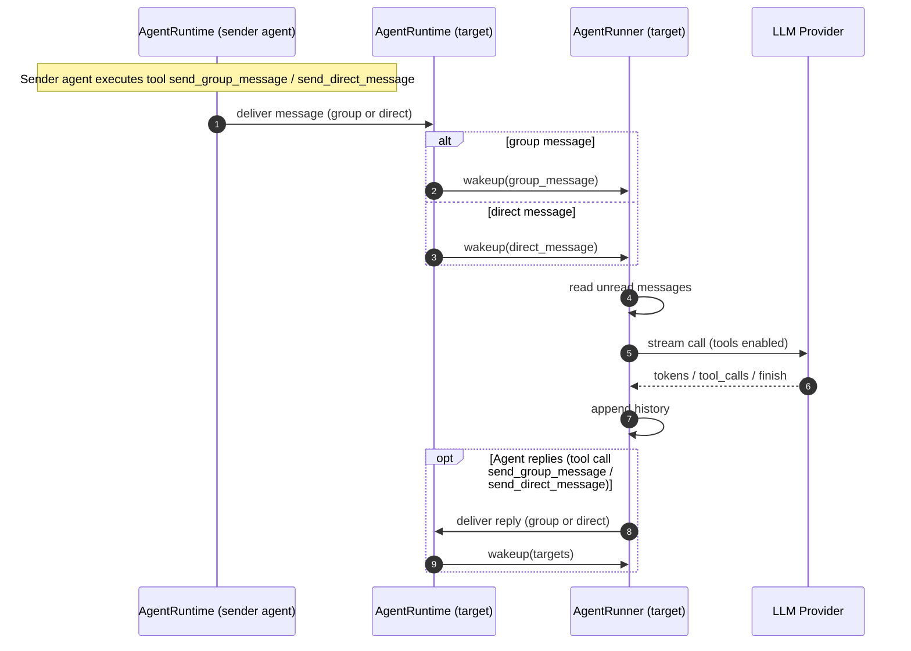

# what/why/how


```
  What

  - Swarm‑IDE 是一个“多 Agent 即时通讯 + 协作可视化”的 Web 应用：可以动态创建子代理、与任意代理对话，并用实时图谱/上下文
    面板看到协作链路与推理过程。
  - 以 workspace/agent/group/message 为基本模型，提供微信式多会话 UI、LLM history 面板、工具调用流的实时展示。

  Why

  - 解决多 Agent 协作“黑箱化”和不可控的问题：让拓扑可观察、可介入、可调试。
  - 以“极简通信原语（create + send）”支持自组织、动态演化的协作结构。

  How

  - 事件驱动的 Agent Runtime：拉取未读 → 流式调用 LLM → 工具调用 → 结果回写历史 → UI 事件广播。
  - 通过 SSE 把 agent 的推理/工具调用/消息流实时推送到 UI。
  - UI 端用图谱 + 树状会话列表 + 历史上下文面板来展示协作状态，并支持人类随时介入任意层级。
```

# Agent组织架构

```
   // 三层数据聚合
   1. agents: 节点层（Agent 元数据）
   2. groups: 关系层（群组成员关系）
   3. messages: 交互层（消息流向与频次）
```


```
   Workspace A
   ├── Agents
   │   ├── human-001 (用户)
   │   ├── assistant-001 (助手)
   │   └── coder-001 (编程子代理，parentId=assistant-001)
   │
   └── Groups
       ├── group-1 (默认对话)
       │   └── members: [human-001, assistant-001]
       │
       ├── group-2 (编程对话)
       │   └── members: [human-001, coder-001, assistant-001]
       │
       └── group-3 (子代理协作)
           └── members: [coder-001, assistant-001]
```

sql中的表
```
   agents (Agent 表)
     ├─ id (主键)
     ├─ workspaceId (外键 → workspaces)
     ├─ role ("human"/"assistant"/"sub-agent")
     └─ parentId (外键 → agents.id，用于层级)

   groups (群组表)
     ├─ id (主键)
     ├─ workspaceId (外键 → workspaces)
     ├─ name (群组名称)
     └─ contextTokens (上下文 token 计数)

   groupMembers (多对多关系表)  ⭐ 核心表
     ├─ groupId (外键 → groups.id)
     ├─ userId (外键 → agents.id)  // 注意这里实际引用的是 agents.id
     ├─ lastReadMessageId (已读消息指针)
     └─ joinedAt (加入时间)
     └─ PRIMARY KEY (groupId, userId)
```

AgentRuntime：单一全局实例 管理全局agent
AgentRunner：agent的运行wrapper 通过事件驱动唤醒


# 事件总线

每一个agent都带一个 `AgentEventBus` - 代理事件总线 这个主要是记录运行时轨迹 方便调试
自己发送 `AgentEvent` :
- `agent.wakeup`：Agent 被唤醒（带 agentId、可选 reason）
- `agent.unread`：有未读消息批次（带 agentId、groupId、messageIds）
- `agent.stream`：流式输出片段（reasoning/content/tool_calls/tool_result 等）
- `agent.done`：Agent 结束（可选 finishReason）
- `agent.error`：发生错误（带 message）

全部进程有 `WorkspaceUIBus` 实例

# agent关键运行逻辑循环

被唤醒后 直接按react完成任务

```
   - wakeup() - 唤醒 agent（支持 manual、group_message、direct_message、context_stream        
     等原因）
   - processUntilIdle() - 持续处理所有未读消息，直到无新消息
   - runWithTools() - 处理 LLM 调用和工具执行循环（最多 3 轮）
```

# 消息传递流程图

注意 Agent完成工作后不会自动回复 除非手动继续调用send



# agent的工具


| 名字 | 用途（主要做什么） |
|---|---|
| create | 创建一个子 Agent（指定 role，可选 guidance），用于任务委派；返回 `{agentId}` |
| self | 查询当前 Agent 的身份信息（`agent_id / workspace_id / role`） |
| list_agents | 列出当前 workspace 里的所有 Agent（id + role） |
| send | 给指定 `agent_id` 发私信（自动创建/选择 IM group） |
| list_groups | 列出当前 Agent 可见的群组（groups） |
| list_group_members | 查看某个群组的成员 id 列表（按 `groupId`） |
| create_group | 创建一个群组（给定 memberIds，可选 name） |
| send_group_message | 往某个群组发消息（按 `groupId`，可带 `contentType`） |
| send_direct_message | 给另一个 Agent 发“直聊消息”（自动创建/复用 P2P group，并返回 channel type，可带 `contentType`） |
| get_group_messages | 拉取某个群组的完整历史消息（按 `groupId`） |
| bash | 在服务器上执行 shell 命令（调试/文件操作等），返回 stdout/stderr/exitCode（可选 cwd/timeout/maxOutput） |


# 主要接口

```shell
> ls .\backend\app\api\

    Directory: F:\coding-workspace\learning-projects\swarm-ide\backend\app\api

Mode                 LastWriteTime         Length Name
----                 -------------         ------ ----
d----           2026/1/31    20:01                admin
d----           2026/1/31    20:01                agent-graph
d----           2026/1/31    20:01                agents
d----           2026/1/31    20:01                config
d----           2026/1/31    20:01                debug
d----           2026/1/31    20:01                glm
d----           2026/1/31    20:01                groups
d----           2026/1/31    20:01                health
d----           2026/1/31    20:01                search
d----           2026/1/31    20:01                ui-stream
d----           2026/1/31    20:01                workspaces
```


# agent消息处理

  - AgentRunner.processGroupUnread 会把同一群组内的未读消息拼成一条 role: "user" 的历史记录   
    `[group:{groupId}] {senderId}: {content}`
    见 backend/src/runtime/agent-runtime.ts
  - llm_history 是每个 Agent 全局的，不区分群组；因此多个群的消息会依次追加到同一个历史里，见 
  - 未读拉取按群组批次处理，群组之间的顺序取决于 listUnreadByGroup 遍历顺序（数据库返回顺序， 
    未显式排序）。

# 总结

假设 A B C 在一个群组 A -> C 发送消息。 B也会被唤醒。 （send_group_message）

AgentRunner在协程里在等待唤醒
```ts
  private async loop() {
    while (true) {
      await this.wake.promise; // <-- 在这里阻塞
      if (this.running) continue;
      this.running = true;
      try {
        await this.processUntilIdle();
      } finally {
        this.running = false;
      }
    }
  }
```

然后会简单的append的到messages中去
```ts
    const userContent = unreadMessages
      .map((m) => `[group:${groupId}] ${m.senderId}: ${m.content}`)
      .join("\n");
    history.push({ role: "user", content: userContent });

```

群组消息，共享在群组全部agent的上下文中，只有对应agent自己的工具调用才在自己的上下文。
